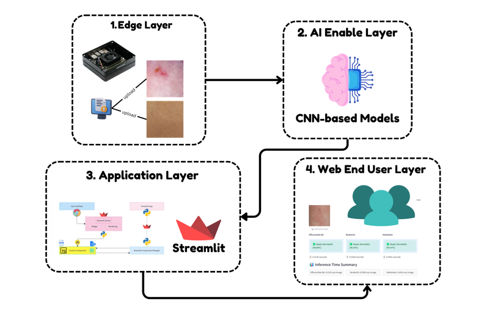
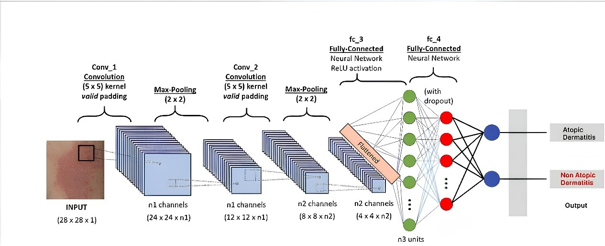
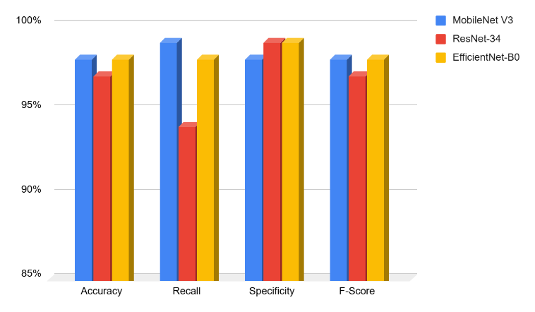
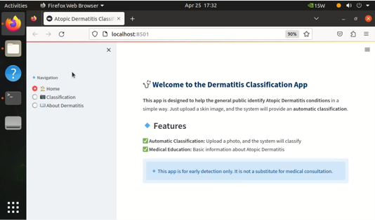
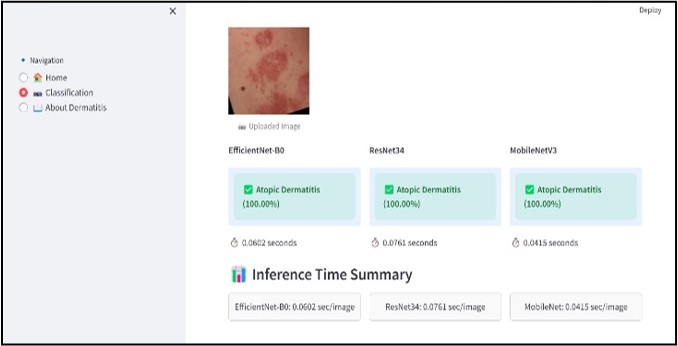
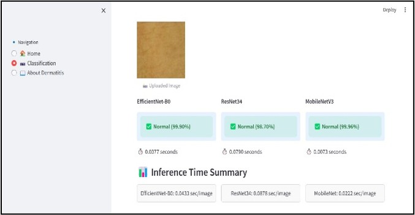

<div align="center">

[](https://ieeexplore.ieee.org/document/11149966)

# Implementation of Edge AI for Web-Based Atopic Dermatitis Skin Disease Classification Using Streamlit 

Alya Irzan Ramadhani (Universitas Syiah Kuala), [Kahlil Muchtar (Universitas Syiah Kuala, COMVISLAB USK)](https://comvis.mystrikingly.com/), Maulisa Oktiana (Universitas Syiah Kuala), Khairun Saddami (Universitas Syiah Kuala), Safrizal Razali (Universitas Syiah Kuala), and Novi Maulina (Universitas Syiah Kuala)

</div>

---

<div align="justify">

> **Abstract:** *Atopic dermatitis (AD) is a chronic skin disease with symptoms such as itching, dryness, and redness that interfere with patients quality of life. Its prevalence continues to increase, especially among children. Early diagnosis is crucial for effective treatment, but traditional methods such as allergy tests and biopsies are time consuming and prone to error. This study proposes an automated classification system based on deep learning integrated with Edge AI for skin image analysis. Edge AI enables local processing, reduces latency, and safeguards data privacy. The system is implemented in a Streamlitbased web application for easy use by medical professionals. Evaluation was conducted using accuracy, precision, recall, specificity, and F1-score. Training results demonstrated high performance: ResNet-34 (96%), MobileNetV3 (98.5%), and EfficientNet-B0 (98.3%), respectively. A system demo is available at: https://www.youtube.com/watch?v=hkbXEbA8Gq0.*

</div><br>

<p align="center">
  
</p>

<small>_Figure 1: Proposed Flowchart_</small>
<br>
<br>

<p align="center">
  
</p>

<small>_Figure 2: Convolutional Neural Network (CNN)_</small>

---

## 📊 Data 

Please download the dataset used in this study from the Google Drive link below.
The dataset is organized into training, validation, and testing sets. Each split contains two classes: Atopic Dermatitis and Normal skin, as used in this study.

  [🔗 Google Drive Link](https://drive.google.com/drive/folders/1cS_ZXeFSc2Dn17G-vgpitjGNXCqdcQwn?usp=sharing)

---

## ⚙️ Hyperparameters

<p align="center"><b>Table 4: Hyperparameter of The Training Process</b></p>
<div align="center">
  <small>
    <table >
        <tr style="background-color:#b3b3b3; text-align:center;">
            <th>Parameter</th>
            <th>EfficientNet-B0</th>
            <th>ResNet-34</th>
            <th>MobileNetV3 </th>
        </tr>
        <tr>
            <td>
            Epoch
            </td>
            <td>50</td>
            <td>50</td>
            <td>50</td>
        </tr>
        <tr>
            <td>Batch Size</td>
            <td>2</td>
            <td>2</td>
            <td>2</td>
        </tr>
        <tr>
            <td>Loss Function </td>
            <td>Cross Entropy</td>
            <td>Cross Entropy</td>
            <td>Cross Entropy</td>
        </tr>
        <tr>
            <td >Learning Rate</td>
            <td>0.01</td>
            <td>0.01</td>
            <td>0.01</td>
        </tr>
        <tr>
            <td>Optimizer</td>
            <td>SGD</td>
            <td>SGD</td>
            <td>SGD</td>
        </tr>
        <tr>
            <td>Momentum</td>
            <td>0.9</td>
            <td>0.9</td>
            <td>0.9</td>
        </tr>
    </table>
  </small>
</div>

---

## 🚀 Run Streamlit Application

The Streamlit application has been provided in this repository. Follow the steps below to run the real-time atopic dermatitis skin disease classification interface.

### 1️⃣ Clone the Repository

```bash
git clone https://github.com/comvislab-usk/EdgeAd.git
cd EdgeAd
```

### 2️⃣ Install Dependencies

```bash
pip install -r requirements.txt
```

<small>If requirements.txt is not available:</small>

```bash
pip install streamlit torch torchvision opencv-python numpy pillow
```

### 3️⃣ Run the Streamlit Application

```bash
streamlit run streamlit/app.py
```

<div style="margin-left: 20px;">
Make sure the trained model files are located in the correct directory.
</div>

---

## 📈 Results

<p align="center"><b>Table 1. Evaluation Metric Results</b></p>
<div align="center">
  <small>
    <table >
        <tr style="background-color:#b3b3b3; text-align:center;">
            <th></th>
            <th>ResNet-34</th>
            <th>EffNet-B0</th>
            <th>MobNetV3</th>
        </tr>
        <tr style="text-align:center;" >
            <td>Training Time</td>
            <td>88m 25s</td>
            <td>50m 71s</td>
            <td>90m 20s</td>
        </tr>
        <tr style="text-align:center;" >
            <td>
            Acc
            </td>
            <td>96%</td>
            <td>98.3%</td>
            <td>98.5%</td>
        </tr>
        <tr style="text-align:center;">
            <td >Rec</td>
            <td>94%</td>
            <td>97.8%</td>
            <td>99%</td>
        </tr>
        <tr style="text-align:center;">
            <td >Spec</td>
            <td>99%</td>
            <td>98%</td>
            <td>98.1%</td>
        </tr>
        <tr style="text-align:center;">
            <td>F1-Score</td>
            <td>96.6%</td>
            <td>98/3%</td>
            <td>98.4%</td>
        </tr>
    </table>
  </small>
</div>
<br>

<p align="center">
  
</p>

<small>_Figure 7: Comparison of Evaluation Metric Result_</small>
<br>

---

## 🎨 Qualitative Results

<p align="center">
  
</p>

<small>_Figure 3: User Interface of Streamlit_</small>
<br>

<p align="center">
  
</p>

<small>_Figure 4: Physical Setting of Edge AI Web-Based Application_</small>
<br>

<p align="center">
  
</p>

<small>_Figure 5: Main Interface of the Classify Atopic Dermatitis, Implemented on the Edge-AI Jetson Orin Nano_</small>
<br>

<p align="center">
  
</p>

<small>_Figure 6: Main Interface of the Classify Normal Skin, Implemented on the Edge-AI Jetson Orin Nano_</small>

---

## 📝 Citation

Please consider citing our paper in your publications if the project helps your research.

```
@inproceedings{Alya2025edgeai,
  title={Implementation of Edge AI for Web-Based Atopic Dermatitis Skin Disease Classification Using Streamlit},
  author={Alya Irzan Ramadhani, Kahlil Muchtar, Maulisa Oktiana, Khairun Saddami, Safrizal Razali, and Novi Maulina},
  booktitle={2025 IEEE International Conference on Advanced Visual and Signal-Based Systems (AVSS)},
  year={2025},
  doi={10.1109/AVSS65446.2025.11149966}
}
```
